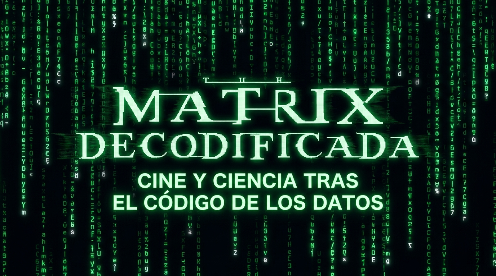

## 🐇 Descripción del EDA

En 1999, el mundo se encontró con una pregunta incómoda: **¿y si todo lo que percibes como real no lo es?**

En _The Matrix_, el protagonista descubre que **la humanidad vive atrapada en una simulación digital** creada por máquinas, mientras sus cuerpos son utilizados como fuente de energía. 

La película consiguió combinar filosofía, acción y efectos visuales nunca vistos hasta entonces y con sus sagas dividió al público entre quienes la vivieron como puro entretenimiento y quienes vieron en ella algo mucho más profundo.

Este EDA (Análisis Exploratorio de Datos) nace precisamente de esa batalla de audiencia. Y es a través de los datos que busco explorar el impacto real de la saga. Por eso, me pregunto si realmente revolucionó el cine de ciencia ficción, si su temática trascendió la pantalla hasta llegar a la comunidad científica y si las secuelas fueron realmente peores o simplemente más difíciles de comprender.

## 💊 Hipótesis

#### 1.- **_The Matrix_ revolucionó el género de la ciencia ficción** 

La película estableció un nuevo estándar de inversión en películas de ciencia ficción. A partir de entonces, las películas del género optaron por impulsar los efectos digitales, con lo que los presupuestos y los especialistas en VFX aumentaron en número por el uso de nuevas tecnologías para dejar con la boca abierta a los espectadores.

#### 2.- **La realidad como simulación: de la ficción a la cultura popular**

La saga *The Matrix* consolidó la [_Teoría de la Simulación_](https://es.wikipedia.org/wiki/Hip%C3%B3tesis_de_simulaci%C3%B3n) como un debate presente en la cultura popular. A través del análisis de sus conceptos en la literatura y, más adelante,en plataformas como YouTube, exploraré si la saga sigue siendo relevante.

#### 3.- **El declive de la saga: ¿motivada por el descenso de calidad?**

Se propone que con una mayor narrativa y más términos complejos, menor es la conexión emocional y la valoración del público general. En realidad, quizás las películas no eran peores, sino que no llegaron a ser comprendidas. Busco si realmente la saga perdió calidad cinematográfica o es que cambió la fórmula que hizo de _The Matrix_ una de las mejores películas de ciencia ficción de la historia moderna.

## 🔌 Datos

Dado que la temática de las hipótesis es variada, también lo serán las distintas fuentes de datos que tengo que utilizar para poder contrastarlas. **A continuación muestro cada hipótesis y las fuentes** que serán utilizadas:

#### Fuentes Hipótesis 1 (__The Matrix_ revolucionó el género de la ciencia ficción_)
Utilizo **datasets** de métricas de cine, obtenidos de **Kaggle**. En concreto, uso datasets de [Tmdb](https://www.kaggle.com/datasets/tmdb/tmdb-movie-metadata), con los que puedo estudiar los presupuestos de las películas por año y la cantidad de especialistas en efectos especiales que han trabajado en ciencia ficción en las últimas décadas.

#### Fuentes Hipótesis 2 (_La realidad como simulación: ciencia ficción vs papers_)
Para contrastar la hipótesis uso la librería arXiv. También utilizo **Google Ngrams**, que es una herramienta de Google que analiza la frecuencia con la que aparecen palabras o frases en millones de libros digitalizados a lo largo del tiempo. Y para adentrarme en **YouTube**, utilizaré su API para investigar vídeos que toquen temas relacionados con la saga.

#### Fuentes Hipótesis 3 (_El declive de la saga: ¿motivada por el descenso de calidad?_)
Para acabar he elegido unos **datasets** muy curiosos, ya que cada uno de ellos contiene las transcripciones de las películas, que me servirán para estudiar si los guiones eran peores o, simplemente, se fueron complicando. Los datasets están agrupados en **Kaggle** bajo el nombre [The Matrix](https://www.kaggle.com/datasets/nixongeno/the-matrix-movie-transcripts). Para el procesamiento de las transcripciones se utilizarán dos librerías especializadas en procesamiento de lenguaje natural: **NLTK y SpaCy**. Y dado que el tercero no me valía, he tenido que hacer **webscrapping** para crear el csv correspondiente. 

## 💻 Tecnologías Utilizadas

* **Lenguaje:** Python 3.12

* **Análisis de datos:** Pandas, NumPy

* **Visualización:** Matplotlib / Seaborn

* **Procesamiento de Lenguaje:** NLTK / SpaCy (para análisis de guiones)

* **Apoyo presentación y archivos:** Gemini (Nano Banana 2) 

## 💾 Estructura del [Repositorio](https://github.com/RobertoCantero82/EDA_matrix_decodificada)

#### CARPETAS:

* **presentacion/:** se incluye el archivo de soporte para la exposición del EDA (10 minutos).

* **recursos/:** carpeta con material multimedia (img, audio, video), que servirá de apoyo en la presentación.

* **src/:** carpeta que contiene la parte fundamental del proyecto.  

    * **codigo/:** módulos de Python y archivos necesarios para que el EDA sea funcional.

    * **datos/:** datasets originales y procesados.

    * **notebooks/:** cuadernos de Jupyter con pruebas realizadas para plantear hipótesis y su resolución.

    * **memoria.ipynb:** cuaderno principal con el desarrollo completo, limpiezas, visualizaciones y conclusiones.

#### ARCHIVOS: 

* **presentacion_EDA**: explicación inicial del proyecto, donde se incluye el tema elegido, una breve explicación de la película y la saga, las hipótesis planteadas y cómo serán los primeros pasos para poder obtener conclusiones profesionales.

* **README.md:** archivo que será el punto de partida de quien entra al repositorio de GitHub para conocer qué es lo que se encontrará al acceder al EDA.

_Nota: Los archivos contenidos en src/data/brutos/ no se incluyen en este repositorio y deben ser descargados de sus fuentes originales, debido a restricciones de tamaño de GitHub._
