<p align="center">
  
</p>

<h1 align="center">EDA Matrix Decodificada</h1>

---

## 🐇 Descripción

En 1999, el mundo se encontró con una pregunta incómoda: **¿y si todo lo que percibes como real no lo es?**

En _The Matrix_, el protagonista descubre que la humanidad vive atrapada en una simulación digital. La película combinó filosofía, acción y efectos visuales nunca vistos, dividiendo al público entre quienes la vivieron como puro entretenimiento y quienes vieron algo mucho más profundo.

Este EDA nace de esa batalla de audiencia. A través de los datos exploro si _The Matrix_ revolucionó realmente el cine de ciencia ficción, si su temática trascendió la pantalla hasta la comunidad científica, y si las secuelas fueron peores o simplemente más difíciles de comprender.

---

## 💊 Hipótesis

**1. _The Matrix_ revolucionó el género de la ciencia ficción**

La película estableció un nuevo estándar de inversión en el género. A partir de entonces, los presupuestos y los especialistas en VFX aumentaron por el uso de nuevas tecnologías.

**2. La realidad como simulación: de la ficción a la cultura popular**

La saga consolidó la [_Teoría de la Simulación_](https://es.wikipedia.org/wiki/Hip%C3%B3tesis_de_simulaci%C3%B3n) como debate presente en la cultura popular. Analizo su presencia en literatura científica y plataformas como YouTube.

**3. El declive de la saga: ¿descenso de calidad o de comprensión?**

Con una narrativa más compleja, menor fue la conexión emocional del público. Busco si la saga perdió calidad cinematográfica o simplemente cambió la fórmula que la hizo grande.

---

## 🔌 Datos

| Hipótesis | Fuentes |
|---|---|
| Revolución del género | Datasets de [TMDB — Kaggle](https://www.kaggle.com/datasets/tmdb/tmdb-movie-metadata): presupuestos y especialistas en VFX |
| Simulación en la cultura | arXiv (papers), Google Ngrams (libros), YouTube API (vídeos) |
| Declive de la saga | Transcripciones de las películas — [The Matrix transcripts — Kaggle](https://www.kaggle.com/datasets/nixongeno/the-matrix-movie-transcripts) + webscrapping |

---

## 🗂️ Estructura del proyecto

```
EDA_matrix_decodificada/
│
├── src/
│   ├── codigo/            # Módulos Python del proyecto
│   ├── datos/             # Datasets originales y procesados
│   ├── notebooks/         # Pruebas y exploración por hipótesis
│   └── memoria.ipynb      # Notebook principal con el análisis completo
│
├── presentacion/          # Soporte para la exposición (PDF, PPTX)
├── recursos/              # Material multimedia (img, audio, video)
│
├── presentacion_EDA.ipynb # Presentación inicial del proyecto
└── README.md
```

> Los archivos en `src/datos/brutos/` no se incluyen en el repo — deben descargarse de sus fuentes originales por restricciones de tamaño de GitHub.

---

## 🛠️ Tecnologías


---

## 👤 Autor

**Roberto Cantero** — proyecto de Análisis Exploratorio de Datos
